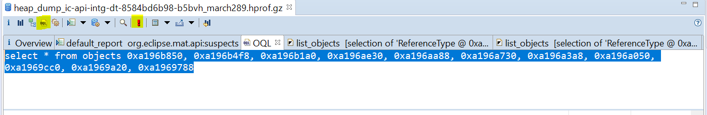

# Eclipse Memory Analyzer Tool - Object Query Language (OQL) 



## Listing all the objects using the object-id

```
select * from objects 0xa196b850, 0xa196b4f8, 0xa196b1a0, 0xa196ae30, 0xa196aa88, 0xa196a730, 0xa196a3a8, 0xa196a050, 0xa1969cc0, 0xa1969a20, 0xa1969788
```
