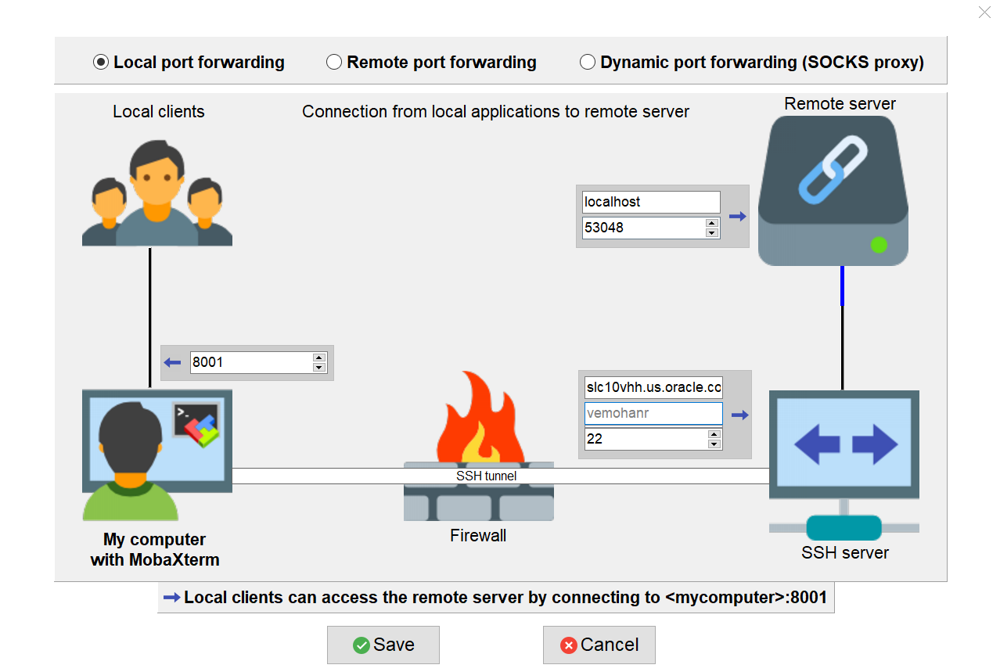

# Tunneling in MobaXTerm
We can use simple putty to SSH into a remote machine but that will not help in tunneling and session restart etc. 

Tunneling in this context is nothing but accessing the services hosted in the remote machine in out local machine.

1. Download the MobaXTerm [https://mobaxterm.mobatek.net/download.html](https://mobaxterm.mobatek.net/download.html)

2. Run the istio dashboard command (istio dashboard jaeger)
		
   

3. Select the Tunneling option in the MobaXTerm
   
   
   
4. Fill in the details about the remote host, port number etc

   
   
5. Start the Tunnel   

   
   
6. Open the URL in the host browser

         