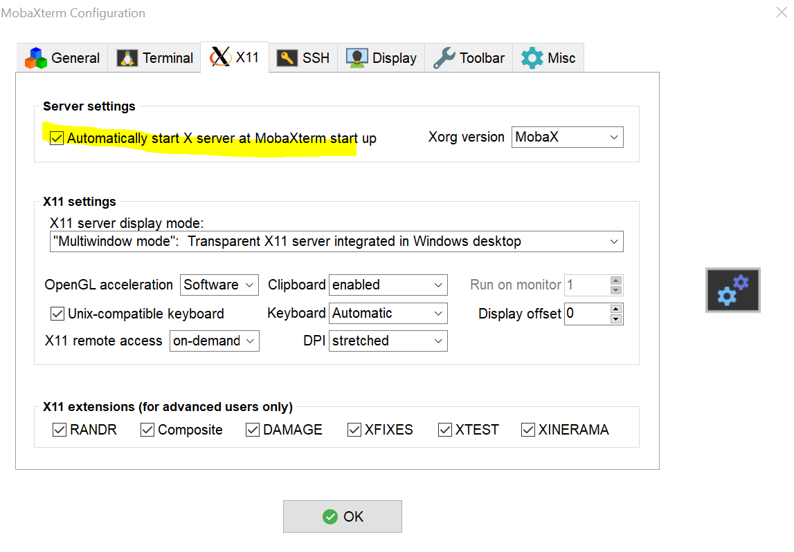

# XMing - Alternative to VNC server
Ever wondered how to open the UI/GUI of the applications installed in remote Linux server in our local development environment. Usecases like codebase is in remote server and we SSH into it to build the code etc and instead of using VNC to get the graphical interface, we can use this technique to open the applications installed in the remote server

## Steps

1. Install XMing server [https://sourceforge.net/projects/xming/](https://sourceforge.net/projects/xming/) in the local machine

2. Enable X11 forwarding in putty or other SSH tool 
 
 
3. SSH into the remote server

4. Launch the application and we should see the application opening in local machine 
 